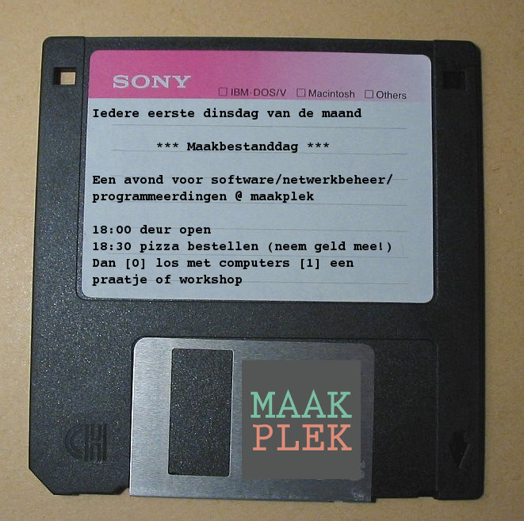

# computerplek

De GitHubplek van de computerplek van de maakplek

## Dinsdag 13 september

De eerste maakbestanddag heeft een licht programma:

 * 18:00 deur open
 * 18:30 pizza bestellen
 * 19:30 show-and-tell [*][$][%]
    * @janderkkotlarski: 2D C++ game(s) met SFML
    * @Modanung: 3D C++ game(s) met Urho3D
    * @sandervankasteel: een gehackt apparaaten

 * [*] show-and-tell = iemand vertelt maximaal tien minuten over wat hij/zij heeft gemaakt
 * [$] begintijd kan verschuiven naar later. De sprekers zullen hun pizza moeten hebben kunnen opgegeten
 * [%] volgorde van de sprekers nu op alfabet, maar dit hoeft niet de volgorde van spreken te zijn
